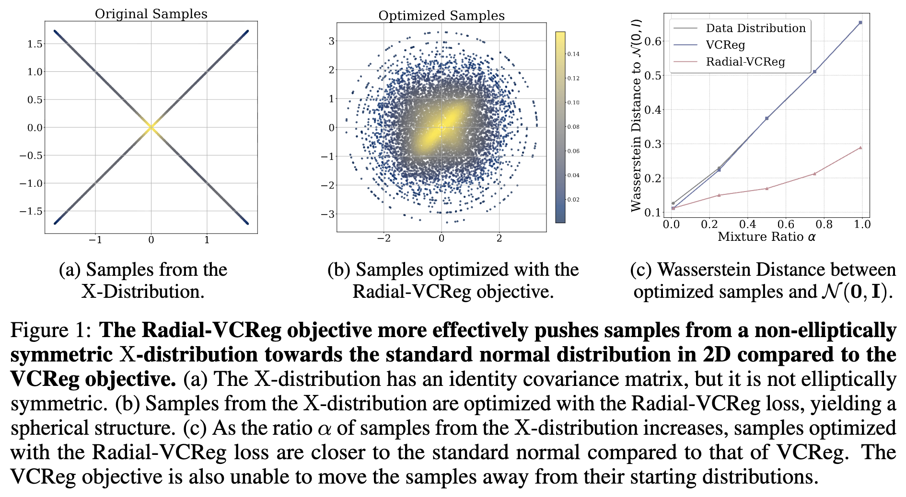

# RadialVCReg

This repository contains the code for **Radial-VCReg: More Informative Representation Learning Through Radial Gaussianization** ([OpenReview](https://openreview.net/forum?id=pQ2LZnZDDp)).


## Overview

**Radial-VCReg** is a self-supervised learning method that **radially Gaussianize feature distributions** while imposing the VCReg second-order constraints. By aligning the feature radial marginals towards the Chi distribution, Radial-VCReg **removes degenerate VCReg solutions** where isotropic covariance can be achieved despite strong higher-order dependencies between feature dimensions.

<div align="center">
  
</div>


## Installation

The required dependencies can be installed by running
```bash
pip install -r requirements.txt
```

## Synthetic Data Experiments

To run Radial-VCReg over the X distribution, use the following python script

```python
python train_xdist.py --synthetic_distribution_shapes X gauss --synthetic_distribution_samples 10000 0 --var_loss_weight=1.0 --cov_loss_weight=1.0 --radial_ce_loss_weight=100.0 --radial_ent_loss_weight=100.0 --use_radial_ent_sigmoid=False --embedding_sparsity_loss_weight=0.0 --e2mc_loss_weight=0.0 --base_lr=5e-1 --schedule_type="linear" --wandb_project="ssl-gaussianization" --wandb_entity="yilunkuang" --wandb_name="" --use_wandb=True
```

To generate synthetic data from the mixture between X and Gaussian distribution, vary the argument to be `--synthetic_distribution_samples N 10000-N`, where `N` is the number of samples from the X distribution.


## Citation
Please cite our work if you find it helpful:
```bibtex
@inproceedings{
kuang2025radialvcreg,
title={Radial-{VCR}eg: More Informative Representation Learning through Radial Gaussianization},
author={Yilun Kuang and Yash Dagade and Deep Chakraborty and Erik Learned-Miller and Randall Balestriero and Tim G. J. Rudner and Yann LeCun},
booktitle={UniReps: 3rd Edition of the Workshop on Unifying Representations in Neural Models},
year={2025},
url={https://openreview.net/forum?id=pQ2LZnZDDp}
}
```
